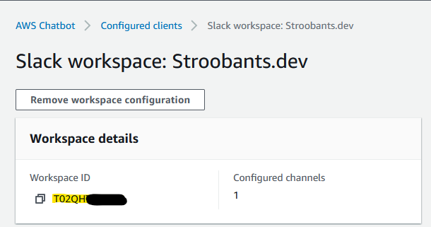

# Daily spend to slack

A construct that deploys a CloudWatch cronjob that will trigger a Lambda that will fetch the yesterday usage of AWS and send it to a SNS as a spoofed ECR CloudWatch event that can be parsed by AWS Chatbot and send to Slack.

Yes, that was a mouthful. But the general idea is that to create a FinOps/Cost optimization culture in your team, your team also needs to know what they are spending. That is why I created this. This construct will deliver the yesterday usage to your slack channel of choice. This can also be a private channel.


## Installation

### Manual steps

Your AWS account must be connected with your Slack channel. This **can't be done by IaC** but involves manual steps.

1. Follow [the steps of Step 1](https://docs.aws.amazon.com/chatbot/latest/adminguide/getting-started.html#chat-client-setup) in the category "Setting up AWS Chatbot with Slack"

### CDK steps

```typescript
'use strict';
import { App, Stack } from 'aws-cdk-lib';
import { Schedule } from 'aws-cdk-lib/aws-events';
import { DailySpendToSlack } from './index';

const app = new App();
const stack = new Stack(app, 'DailySpendToSlack');

new DailySpendToSlack(stack, 'DailySpendToSlack', {
  schedule: Schedule.cron({ minute: '0', hour: '9' }),
  slackWorkspaceId: '',
  slackChannelId: '',
  slackChannelName: '',
  accountName: 'stroobants.dev',
});
```

#### Parameters

* `schedule`: Schedule - The schedule it should run on, for example `Schedule.cron({ minute: '0', hour: '9' })` means everyday at 09:00 UTC
* `slackWorkspaceId`: string - The ID that AWS generates for (see picture below)
* `slackChannelId`: string - The ID of the Slack Channel (Open slack, right-click on the channel you want the bot in, Copy link) -> `https://cloudar.slack.com/archives/{slackChannelId}`)
* `slackChannelName`: string - The name of the Slack channel (this will be used to generate the Configuration name)
* `accountName`: string - You can give the bot a recognizable name, lowercase, max 30 and only `.-` allowed (could be more but that is what I tested)



## License

[Mozilla Public License 2.0](https://choosealicense.com/licenses/mpl-2.0/)

